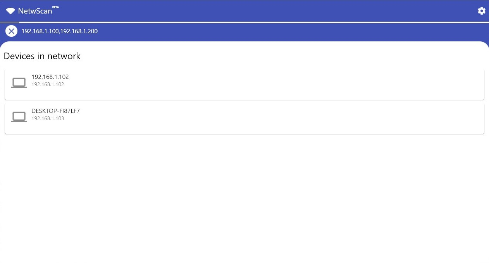
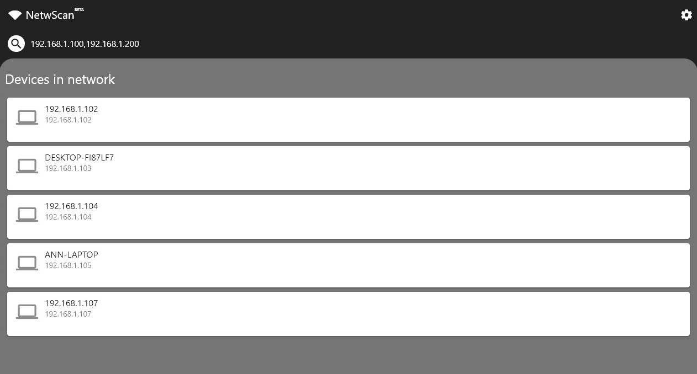

# NetwScan (BETA)

Local Network Search Tool




# Adding languages

Go to `lib/language.json` create a new language according to skeleton

```json
"en-US": {
        "visibleText": "English",
        "a1": "Devices in network",
        "a2": "Specify range, Example: 192.168.1.100, 192.168.1.200",
        "a3": "Start search",
        "a4": "Cancel search",
        "a5": "Unable to find device in network",
        "a6": "Settings",
        "a7": "Theme",
        "a8": "Light",
        "a9": "Dark",
        "a10": "App Theme",
        "a11": "Changes app theme between light, dark and system default mode",
        "a12": "Search Speed",
        "a13": "Changes search speed, gives more time to devices for defining themselves",
        "a14": "Default Range",
        "a15": "Sets default ip range in range field",
        "a16": "System Default",
        "a17": "App Version",
        "a18": "Build ID",
        "a19": "Second address must be greater than first address, Example: 192.168.1.100, 192.168.1.200",
        "a20": "Given IP adress range is not correct, Example: 192.168.1.100, 192.168.1.200",
        "a21": "App Language",
        "a22": "Changes ui language",
        "a23": "You can enter different IP range and try again.",
        "a24": "Start Search",
        "a25": "You can start the search by entering an IP range in the box above; For example: 192.168.1.100, 192.168.1.200",
        "a26": "Unsupported operating system",
        "a27": "This program does not support your os, please try again in next update",
        "a28": "Ok",
        "a29": "Searching",
        "a30": "Search started, this may take a few minutes."
    },
```
